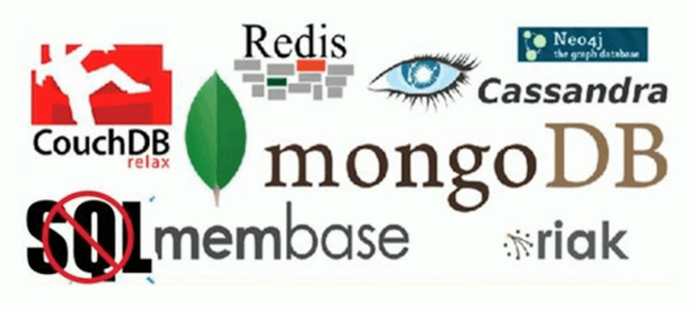

# 01-NoSQL的概述.md

## 什么是NoSQL

* NoSQL = Not Only SQL
* 非关系型的数据库

## 为什么需要NoSQL

* High performance - 高并发读写
* Huge Storage - 海量数据的高效率存储和访问
* High Scalability && High Availability - 高可扩展性和高可用性

## 主流NoSQL产品

* [CouchDB](http://couchdb.apache.org/)
* [Redis](https://redis.io/)
* [Cassandra](http://cassandra.apache.org/)
* [mongoDB](https://www.mongodb.com/)
* [neo4j](https://neo4j.com/)
* [membase](http://www.membase.org/) 已更名为 [Couchbase](https://www.couchbase.com/)
* [riak](http://basho.com/products/)

## NoSQL数据库的四大分类

* 键值(Key-Value)存储
* 列存储
* 文档数据库
* 图形数据库

## 四类NoSQL数据库比较

|         分类        |                       相关产品                      |                   典型应用                  |              数据模型              |                     优点                     |                           缺点                           |
|:-------------------:|:---------------------------------------------------:|:-------------------------------------------:|:----------------------------------:|:--------------------------------------------:|:--------------------------------------------------------:|
| 键值（key-value）   | Tokyo Cabinet/Tyrant、Redis、Voldemort、Berkeley DB | 内容缓存，主要用于处理大量数据的高访问负载  | 一系列键值对                       | 快速查询                                     | 存储的数据缺少结构化                                     |
| 列存储数据库        | Cassandra、HBase、Riak                              | 分布式的文件系统                            | 以列簇式存储，将同一列数据存在一起 | 查找速度快，可扩展性强，更容易进行分布式扩展 | 功能相对局限                                             |
| 文档型数据库        | CouchDB、MongoDB                                    | Web应用（与key-value类似，Value是结构化的） | 一系列键值对                       | 数据结构要求不严                             | 查询性能不高，而且缺乏统一的查询语法                     |
| 图形（Graph）数据库 | Neo4J、InfoGrid、Infinite Graph                     | 社交网络，推荐系统，专注于构建关系图谱      | 图结构                             | 利用图结构相关算法                           | 需要对整个图做计算才能得出结果，不容易做分布式的集群方案 |

## NoSQL的特点

* 易扩展
* 灵活的数据模型
* 大数据量，高性能
* 高可用

